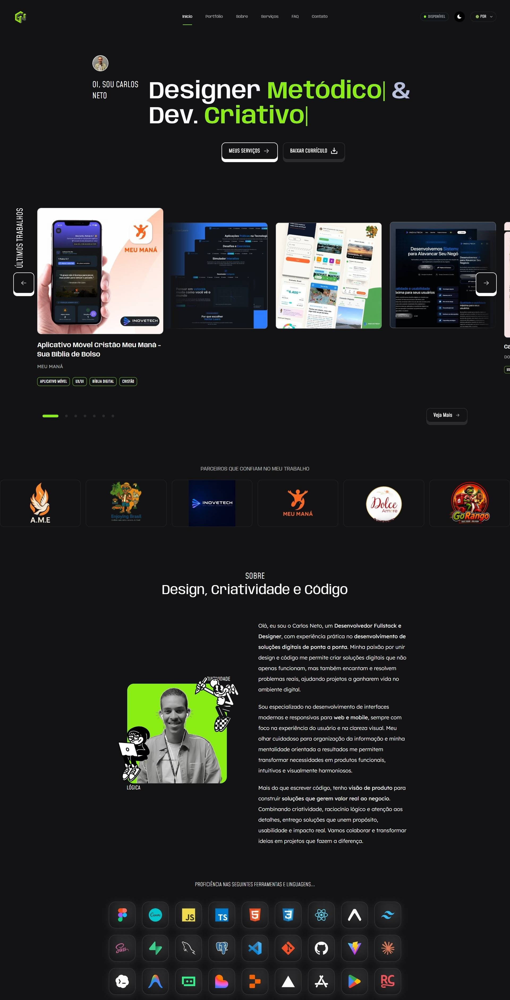
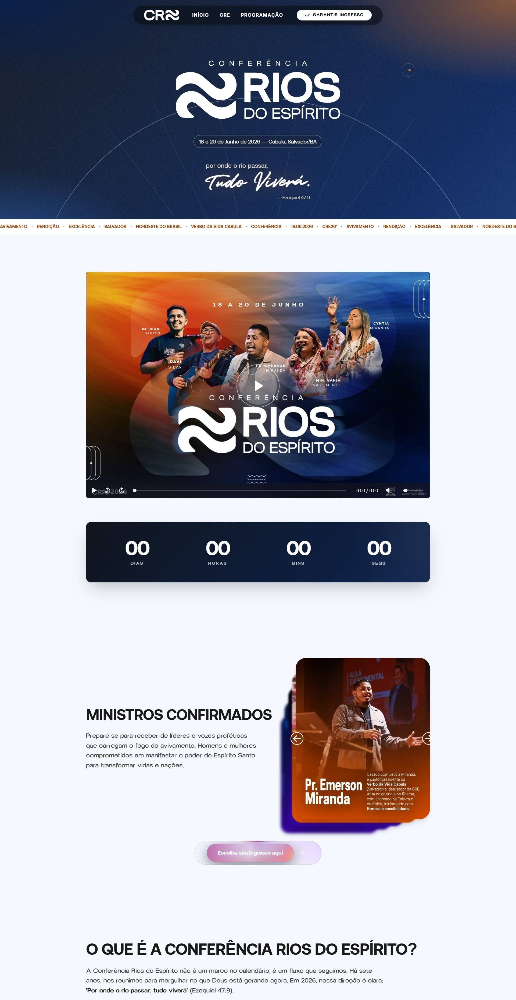
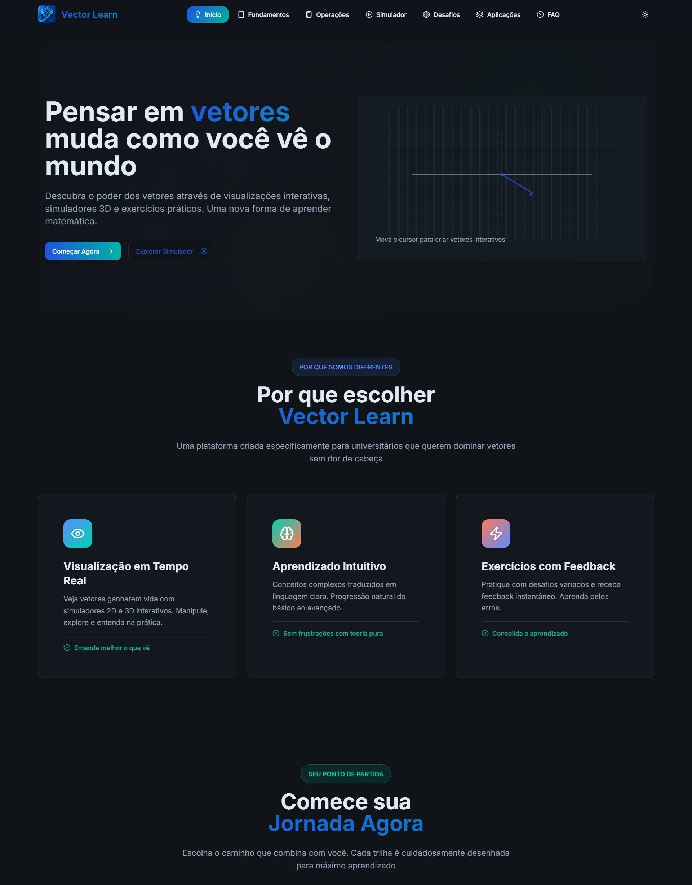
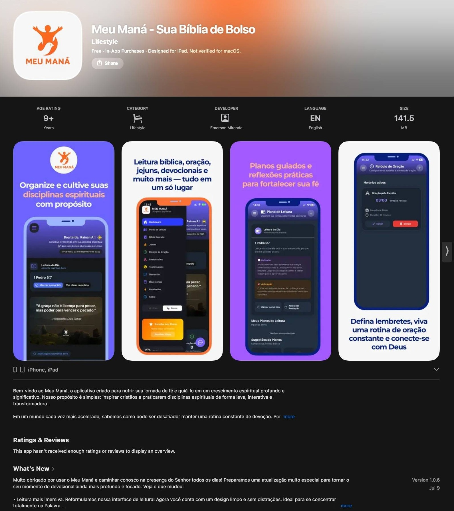

  

- 💻 Desenvolvedor Full‑Stack: crio produtos digitais escaláveis e de alta performance, focando em experiência do usuário e resultados mensuráveis para o negócio.
- 📚 Estudante de Engenharia da Computação (Unijorge) e Desenvolvedor Web & Mobile, entrego soluções em produção com foco em performance, qualidade e prazo.
- ⭐ Experiência prática em aplicações web e mobile: integrações com APIs, autenticação, bancos de dados e arquitetura de interfaces.

 
 

# 🧠 Tecnologias

 

 
 

# 📌 Projetos em Destaque

<table>
  <tr>
    <td width="50%" valign="top">
      <h3 align="center">Web Portfólio</h3>
      
      
Portfólio otimizado para performance e SEO, projetado para mostrar estudos de caso claros, resultados mensuráveis e uma experiência de navegação rápida.

      
<code>Next.js</code> <code>TypeScript</code> <code>Tailwind CSS</code> <code>Vercel</code>

      
<a href="https://carlosnetodev.vercel.app/" target="_blank"><strong>🔗 Ver Portfólio Completo</strong></a> · <a href="https://github.com/Carlos2505dev/webportfolio-Carlos"><strong>📂 Repositório</strong></a>

    </td>
    <td width="50%" valign="top">
      <h3 align="center">Rios do Espírito</h3>
      
      
Landing page de alta conversão para a conferência Rios do Espírito, focada em captação de inscritos, apresentação de palestrantes e informação clara sobre programação e inscrição.

      
<code>React</code> <code>TypeScript</code> <code>Tailwind CSS</code> <code>Vite</code>

      
<a href="https://conferenciariosdoespirito.vercel.app/"><strong>🔗 Ver site no ar</strong></a> · <a href="https://github.com/Carlos2505dev/rios-do-espirito-lp"><strong>📂 Repositório</strong></a>

    </td>
  </tr>
  <tr>
    <td width="50%" valign="top">
      <h3 align="center">Vector Learn</h3>
      
      
Plataforma educacional com simuladores 3D e exercícios interativos que tornam o aprendizado de vetores e análise espacial prático, visual e orientado a projetos.

      
<code>React</code> <code>TypeScript</code> <code>Vite</code> <code>Three.js</code>

      
<a href="https://vectorslearn.vercel.app/" target="_blank"><strong>🔗 Ver a plataforma no ar</strong></a> · <a href="https://github.com/Carlos2505dev/Vector-Learn"><strong>📂 Repositório</strong></a>

    </td>
    <td width="50%" valign="top">
      <h3 align="center">Meu Maná</h3>
      
      
Aplicativo cristão multiplataforma para organizar disciplinas espirituais: planos de leitura, lembretes diários, registro de orações e reflexões, e progresso pessoal com notificações. <em>O código-fonte é propriedade da InoveTech e não está disponível publicamente.</em>
      

      
<code>React Native</code> <code>Expo</code> <code>TypeScript</code>

      
<a href="#" target="_blank"><strong>🔗 Ver o aplicativo no ar</strong></a>

    </td>
  </tr>
</table>

---

 
 

# 🌐 Onde Me Encontrar

  <table>
    <tr>
      <td align="center">
        
      </td>
      <td align="center">
        
      </td>
      <td align="center">
        
      </td>
    </tr>
  </table>

 
 

# ⚙️ Estatísticas no Github

